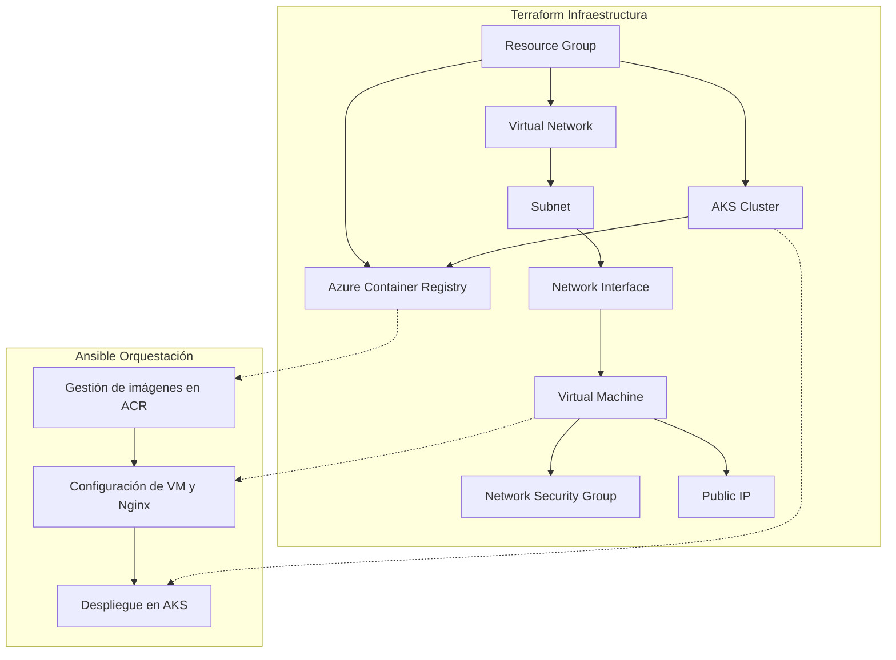

# Proyecto Azure CP2 - UNIR

## Descripción General

Este proyecto implementa una infraestructura completa en Azure usando **Terraform** para el aprovisionamiento y **Ansible** para la orquestación y despliegue de aplicaciones. El objetivo es desplegar una solución compuesta por:

- Un registro de contenedores (ACR)
- Una máquina virtual Linux (VM) con Nginx
- Un clúster de Kubernetes (AKS) con almacenamiento persistente

## Estructura de Carpetas

```
.
├── ansible/
│   ├── inventory.ini         # Inventario de hosts para Ansible
│   ├── kubeconfig           # Configuración de acceso a AKS
│   ├── playbook.yml         # Playbook principal que orquesta los roles
│   ├── secrets.yml          # Variables sensibles (usuarios, contraseñas)
│   └── roles/
│       ├── acr/
│       │   └── task/
│       │       └── main.yml # Gestión de imágenes en ACR
│       ├── aks/
│       │   └── tasks/
│       │       └── main.yml # Despliegue de la app en AKS
│       └── vm/
│           └── task/
│               └── main.yml # Configuración de la VM y Nginx
├── terraform/
│   ├── acr.tf               # Definición del Azure Container Registry
│   ├── aks.tf               # Definición del clúster AKS
│   ├── network.tf           # Red, subredes y reglas de seguridad
│   ├── outputs.tf           # Salidas útiles (IP, credenciales, etc.)
│   ├── provider.tf          # Configuración del proveedor Azure
│   ├── resource-group.tf    # Grupo de recursos principal
│   ├── terraform.tfvars     # Variables de entorno
│   ├── vars.tf              # Definición de variables
│   └── vm.tf                # Definición de la máquina virtual
└── terraform.tfstate        # Estado de Terraform
```

## Infraestructura (Terraform)

- **Resource Group**: Agrupa todos los recursos de Azure.
- **Virtual Network/Subnet**: Red y subred para la VM y AKS.
- **Network Security Group**: Reglas para permitir SSH y HTTP.
- **Public IP**: IP pública para la VM.
- **VM Linux**: Instala Podman y despliega Nginx desde ACR.
- **Azure Container Registry (ACR)**: Almacena imágenes Docker.
- **AKS Cluster**: Orquesta la aplicación y gestiona almacenamiento persistente.

## Orquestación y Despliegue (Ansible)

- **Gestión de imágenes en ACR**: Login, descarga, etiquetado y subida de imágenes (nginx, redis, azure-vote-front).
- **Configuración de la VM**: Instala Podman, autentica en ACR, despliega Nginx como contenedor.
- **Despliegue en AKS**: Crea namespace, secretos para acceso a ACR, y recursos de Kubernetes (Redis, frontend, volúmenes persistentes).

## Diagrama de Infraestructura y Orquestación



## Ejecución

### 1. Aprovisionar Infraestructura

```sh
cd terraform
terraform init
terraform apply
```

### 2. Desplegar con Ansible

```sh
cd ../ansible
ansible-playbook -i inventory.ini playbook.yml --ask-vault-pass
```

## Notas

- Las credenciales y secretos están encriptados en `secrets.yml`.
- El archivo `kubeconfig` se genera tras crear el clúster AKS y es necesario para el despliegue en Kubernetes.
- El estado de Terraform (`terraform.tfstate`) no debe compartirse públicamente.

---

> Proyecto desarrollado para la asignatura de Computación en la Nube - UNIR, 2026.
